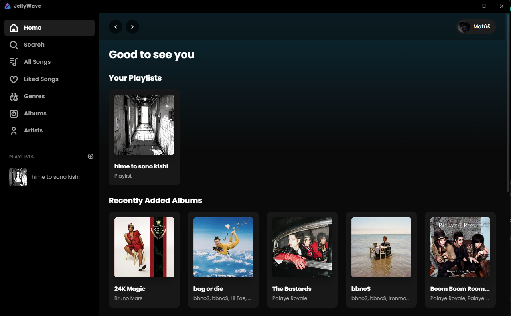
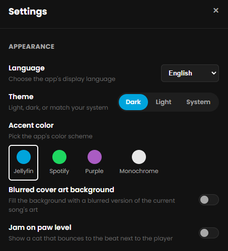
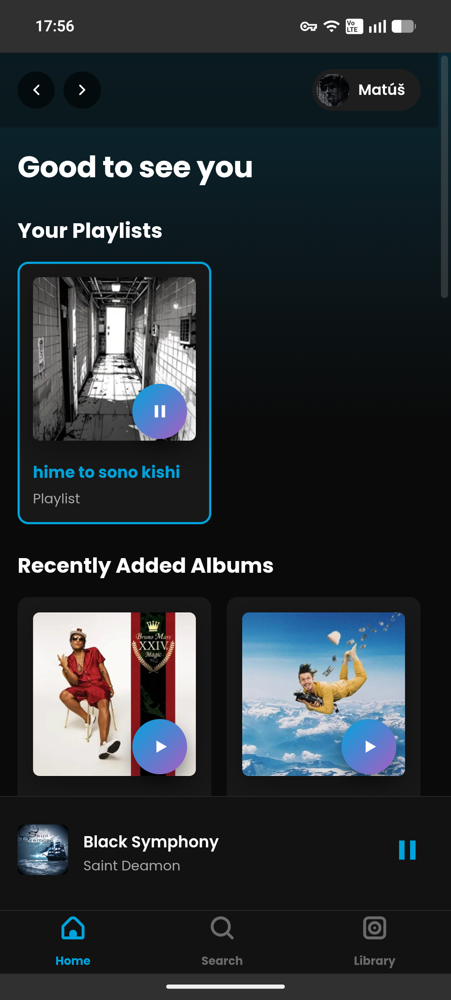
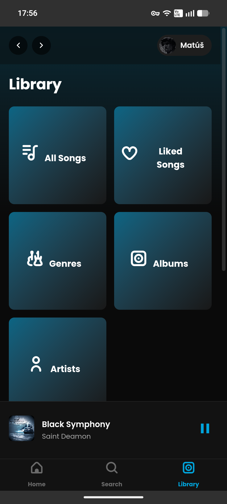
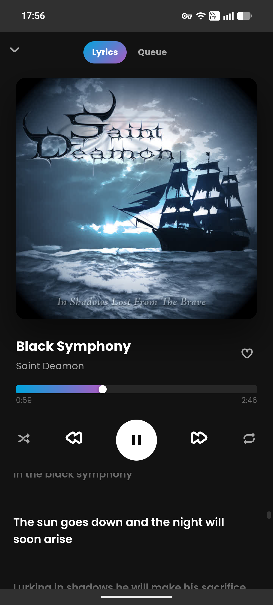

<p align="center">
  
</p>

<h1 align="center">JellyWave</h1>
<p align="center">A sleek, Spotify-styled music client for your own Jellyfin server.</p>

<p align="center">
  <a href="https://github.com/Greenythebeany/jellywave/releases">
    
  </a>
</p>

---

JellyWave is a personal music client for a self-hosted Jellyfin server. It logs into your own server with your own library and gives you a modern, Spotify-like listening experience across desktop and Android, without any of the server-side bloat of a general-purpose media app.

## Screenshots

<p align="center">
  
</p>
<p align="center">
  
</p>

<p align="center">
  
  
  
</p>

## Features

- Full library browsing: Home, Search, All Songs, Liked Songs, Genres, Albums, Artists, and Playlists
- Gapless playback with optional crossfade (0-12 seconds) between tracks
- ReplayGain-based volume normalization, using loudness data from your server
- Lyrics lookup for the currently playing track
- Queue view with shuffle and repeat modes
- Native lock-screen and notification media controls on Android, including playback that survives the app going to the background
- Discord Rich Presence on desktop: shows what you're currently listening to, with cover art
- Custom CSS support for further tweaking the look of the app, including a set of ready-made community color schemes (see [Themes](#themes) below)
- Light and dark themes with multiple accent color palettes, plus a blurred cover-art background option
- "Jam on paw level": an optional cat that bounces along with the actual bass of whatever's playing
- 15 language translations (English, French, German, Slovak, Czech, Spanish, Polish, Russian, Ukrainian, Norwegian, Swedish, Finnish, Danish, Dutch, Italian) with more welcome via contribution
- Desktop app built with Electron, Android app built with Capacitor, with a built-in check for new releases on desktop

## Installation

Grab the latest build from the [Releases](https://github.com/greenythebeany/jellywave/releases/latest) page:

- **Windows**: download and run the installer (`.exe`)
- **Android**: download the `.apk` and install it (you will need to allow installs from your browser or file manager the first time)

On first launch, enter the address of your own Jellyfin server and sign in with your Jellyfin account.

## Themes

JellyWave ships a handful of built-in accent palettes, but you can also drop in a full community color scheme through **Settings → Advanced → Custom CSS** — paste one line in and it takes effect immediately, no restart needed:

| Preview | Theme | `@import` line |
| --- | --- | --- |
|  | Catppuccin Mocha | `@import url('https://cdn.jsdelivr.net/gh/greenythebeany/jellywave@main/src/themes/catppuccin-mocha.css');` |
|  | Catppuccin Macchiato | `@import url('https://cdn.jsdelivr.net/gh/greenythebeany/jellywave@main/src/themes/catppuccin-macchiato.css');` |
|  | Catppuccin Frappé | `@import url('https://cdn.jsdelivr.net/gh/greenythebeany/jellywave@main/src/themes/catppuccin-frappe.css');` |
|  | Catppuccin Latte | `@import url('https://cdn.jsdelivr.net/gh/greenythebeany/jellywave@main/src/themes/catppuccin-latte.css');` |
|  | Dracula | `@import url('https://cdn.jsdelivr.net/gh/greenythebeany/jellywave@main/src/themes/dracula.css');` |
|  | Nord | `@import url('https://cdn.jsdelivr.net/gh/greenythebeany/jellywave@main/src/themes/nord.css');` |
|  | Gruvbox Dark | `@import url('https://cdn.jsdelivr.net/gh/greenythebeany/jellywave@main/src/themes/gruvbox-dark.css');` |
|  | Gruvbox Light | `@import url('https://cdn.jsdelivr.net/gh/greenythebeany/jellywave@main/src/themes/gruvbox-light.css');` |
|  | Tokyo Night | `@import url('https://cdn.jsdelivr.net/gh/greenythebeany/jellywave@main/src/themes/tokyonight.css');` |
|  | Rosé Pine | `@import url('https://cdn.jsdelivr.net/gh/greenythebeany/jellywave@main/src/themes/rose-pine.css');` |
|  | Rosé Pine Moon | `@import url('https://cdn.jsdelivr.net/gh/greenythebeany/jellywave@main/src/themes/rose-pine-moon.css');` |
|  | Rosé Pine Dawn | `@import url('https://cdn.jsdelivr.net/gh/greenythebeany/jellywave@main/src/themes/rose-pine-dawn.css');` |
|  | Kanagawa | `@import url('https://cdn.jsdelivr.net/gh/greenythebeany/jellywave@main/src/themes/kanagawa.css');` |
|  | Solarized Dark | `@import url('https://cdn.jsdelivr.net/gh/greenythebeany/jellywave@main/src/themes/solarized-dark.css');` |
|  | Solarized Light | `@import url('https://cdn.jsdelivr.net/gh/greenythebeany/jellywave@main/src/themes/solarized-light.css');` |
|  | system24-inspired | `@import url('https://cdn.jsdelivr.net/gh/greenythebeany/jellywave@main/src/themes/system24.css');` |

The theme source files live in [`src/themes/`](src/themes/) if you want to tweak one or build your own.

### Making your own theme

Start from [`src/themes/template.css`](src/themes/template.css) — it lists every CSS custom property the app's colors are built from, with a short comment on what each one controls. Fill in your colors, paste the whole thing into Settings → Advanced → Custom CSS to preview it live, and once you're happy, save it as `src/themes/your-theme-name.css` and open a PR to get it listed in the table above.

## Discord Rich Presence

On desktop, JellyWave shows your currently playing track on your Discord profile, with cover art. It connects to your local Discord client automatically — the one extra step is authorizing the app once via **Settings → Audio → Discord Rich Presence → Connect** (or open [this link](https://discord.com/oauth2/authorize?client_id=1534197353056174180) directly).

Cover art is looked up externally by artist/album rather than pulled from your Jellyfin server, since Discord requires images to be served over HTTPS and most self-hosted Jellyfin setups are plain HTTP/LAN-only.

## Building from source

```bash
npm install
npm start          # run the desktop app
npm run dist        # build a Windows installer
```

The Android project lives in `android/` and is a standard Capacitor project — open it in Android Studio, or build from the command line with `./gradlew assembleRelease` after setting up your own signing keystore in `android/keystore/keystore.properties`.

## What's new in 1.0.2

- Personal stats (Most Played, On Repeat, Recently Played, the stats page) now sync via your Jellyfin account instead of living in one device's local storage
- A play only counts once a track actually finishes, not just when it starts
- Top Artists now counts each artist on a collab track individually instead of treating "A, B, feat. C" as one distinct artist per lineup
- Connect now properly hands off playback — the sending device stops local audio, and play/pause/skip/seek/volume (desktop, mobile, hardware media keys) all control the connected device until you disconnect or pick something new to play locally
- Connect's device list is now scoped to other JellyWave instances only, and has a mobile entry point (it previously lived in a desktop-only part of the player bar)
- Fixed Connect's now-playing display going stale (an HTTP caching issue on repeated session polls)
- Fixed the app reporting itself as "Desktop" to Jellyfin on every platform, and a stale client version number
- Fixed the installer sometimes being unable to close a running instance during an update
- Recently Played is now a single horizontally-scrolling row instead of a grid that could grow several rows tall
- Fixed a couple of broken icon references (the Connect button, the queue drag handle)

## What's new in 1.0.1

- Fixed session getting logged out on transient network/server errors instead of only on an actual expired token
- Sleep timer (stop playback after N minutes, or at the end of the current track)
- Recently played history view, separate from "recently added"
- Keyboard media key support on desktop (play/pause/skip from your keyboard, not just in-app)
- Smart playlists (auto-generated "most played," "on repeat," genre mixes)
- Swipe gestures on Android track lists (swipe to queue / remove)
- Queue drag-to-reorder (drag a queue item to a new position by its handle)
- Dynamic UI accent color pulled from the currently playing album art, Spotify-style (opt-in in Settings)
- Personal listening stats page (top artists/tracks, total listening time), built from local play history
- Built-in 5-band equalizer (desktop)
- Right-click context menu on desktop for tracks and queue items
- Drag-and-drop a track onto a playlist in the sidebar or a playlist card, on desktop
- Spotify Connect-style device handoff, built on Jellyfin's own `/Sessions` API — hand off playback to another device, or let another Jellyfin client cast to JellyWave

## Acknowledgements

- [Jellyfin](https://jellyfin.org/) for the media server this app talks to
- [Uicons by Flaticon](https://www.flaticon.com/uicons) for the icon set

## License

MIT
